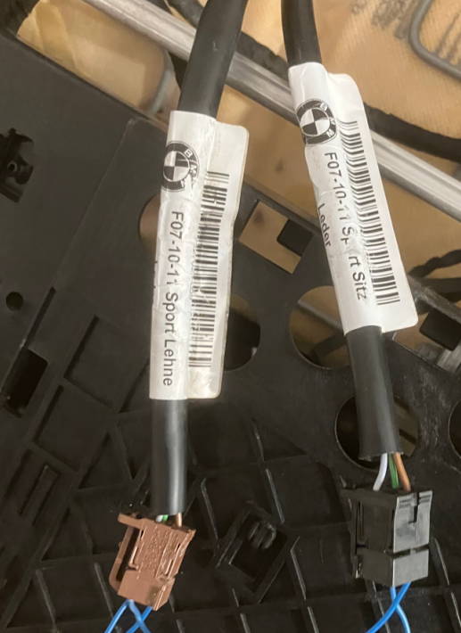
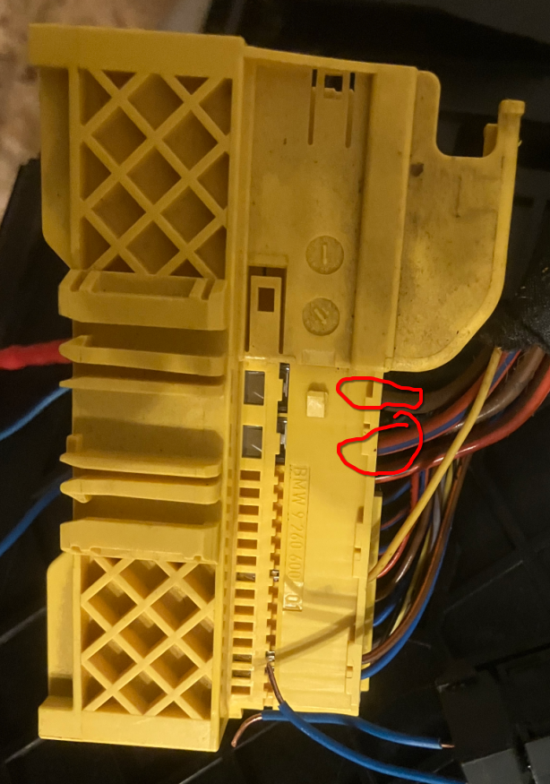
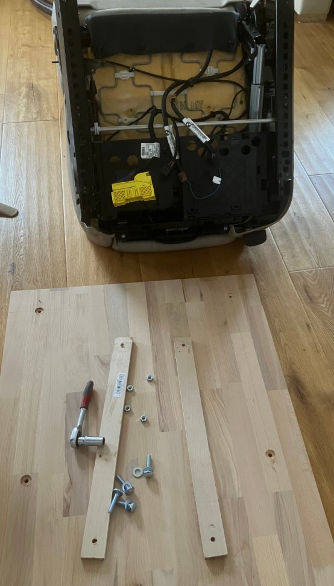

# bmw-seat
## Introduction
Since my son is a huge fan of BMW, we created a small project:
* Buy a used passanger seat
* Create a small logic to allow him to enable e. g. seat heater, temperature indicator, and maybe some other equipment
* Screw the seat on a wooden plate and use it as furniture
This Readme shall guide you through the process in case you plan something similar.

### Credits
https://github.com/ironlungx/nvim-pio for providing the platformio plugin for neovim

### Part numbers
Before we rework the seat, let us summarize the different part numbers of the seat and its sub-components:
- Vehicle: BMW F10
- Airbag: 307130710-AD
- Head support: ks726381711
- Seat ECU: BMW 921646801
- Wiring harness: 9 259 205
- Connector: BMW 91676881

## Electronics
### Seat heater
The seat uses an ECU to control the seat heater. Instead of using the ECU, I disconnected the wiring harness for the back rest and seating surface. Those wiring harnesses have three wires:
- Bround: GND
- Brown/Green: BAT (12V-14V)
- Light grey: Temperature information
According to some measurements, there are strong indications that the temperature pin is connected to GND via a 10kOhm NTC.
The planned implementation will be as follows: By enabling a heater switch, the heater is started. Due to safety concerns, both seat heaters are used in series. A timer of approx. 10mins starts after enabling the heat seater. Once the timer expires, the seat heater is switched off. Additionally, the 10kOhm NTC is monitored and at a temperature beyond 50degC (hysteresis 5degC), the heater is temporarily switched off.

### Fuse
I decided to protect the device with a 5A fuse. Consequently, due to the short wires, 0.5mm2 cable cross section is sufficient.

### Seat knobs
Once the main switch is enabled, the seat knobs to change the position of the seat can be used. You only need to connect GND and BAT (12V-14V) to the yellow main connector (brown and red/blue).

### Switches 
I used two key switches. The first one is a general switch for power supply, both for the seat as well as for the microcontroller ATMEGA328. The purpose of the 2nd switch is the start of the seat heater only.

## Rework
As a first step, please use a professional service to remove the airbag from the seat. Please note that there might be legal requirements that have to be fulfilled. You should also disconnect the connector from the head support to the ECU below the seat to avoid any kind of emergency action.
In my case, I used a wooden plate (80mmx60mmx18mm) in combination with strips of wood to screw the seat to a wooden basis:

